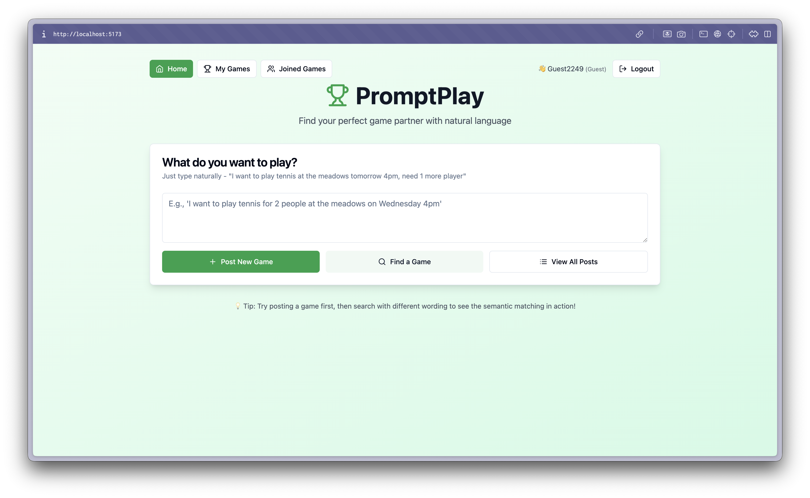

# PromptPlay - AI-Powered Sports Matchmaking Platform

**PromptPlay** is an innovative sports matchmaking application that uses Large Language Models (LLMs) to connect players through natural language. Instead of rigid form-based filtering, users simply describe what they want to play in their own words, and the AI handles the rest.



## Key Innovation

Traditional sports matchmaking apps require users to fill out multiple fields (sport type, location, time, skill level, etc.). PromptPlay revolutionizes this by:

- **Natural Language Understanding**: Just type "I want to play tennis for 2 people at the meadows on Wednesday 4pm""
- **Semantic Matching**: AI understands intent, not just exact keywords
- **Smart Extraction**: Converts casual text into structured game requests
- **Compatibility Scoring**: Finds the best matches based on context, not just filters

## Project Structure

```
cw3/
├── promptplay-backend/     # FastAPI backend with Groq LLM integration
│   ├── main.py            # API endpoints and LLM logic
│   ├── database.py        # SQLAlchemy models
│   ├── auth.py            # JWT authentication
│   └── reset_db.py        # Database utility
└── promptplay-frontend/    # React + Tailwind UI
    ├── src/
    │   ├── App.jsx        # Main application
    │   ├── components/    # Reusable UI components
    │   └── lib/           # Utilities
    └── package.json
```

## Quick Start

### 1. Backend Setup (Terminal 1)

```bash
cd promptplay-backend

# Create virtual environment
python3 -m venv venv
source venv/bin/activate

# Install dependencies
pip install -r requirements.txt

# Create .env file
cp .env.example .env

# Add your Groq API key to .env
# GROQ_API_KEY=your_key_here

# Run the backend
python main.py
```

Backend will be available at: `http://localhost:8000`

### 2. Frontend Setup (Terminal 2)

```bash
cd promptplay-frontend

# Install dependencies
npm install

# Run the frontend
npm run dev
```

Frontend will be available at: `http://localhost:5173`

## Key Features Implemented

### Backend (FastAPI + Groq LLM)

- **User Authentication**: JWT-based auth with guest and registered user support
- **LLM Use Case 1 - NL to Structured Data**: Converts "tennis at meadows tomorrow" → structured JSON
- **LLM Use Case 2 - Semantic Matching**: Intelligently matches compatible game requests
- **Join Request System**: Players can request to join games, hosts can accept/reject
- **Real-time Notifications**: Badge system for pending join requests
- **SQLite Database**: Persistent storage with SQLAlchemy ORM
- **Full CRUD Operations**: Create, read, update, delete game requests
- **Validation & Error Handling**: Comprehensive error messages with suggestions

### Frontend (React + Tailwind + shadcn/ui)

- **Modern Green Theme**: Professional UI with custom animations
- **Multi-View Navigation**: Home, My Games (hosted/joined), Browse Posts
- **Authentication Modal**: Login, register, and guest access
- **Post Game Requests**: Natural language input with AI extraction
- **Find Matches**: Semantic search with compatibility scores
- **Join Request Management**: Send, view, accept/reject requests
- **Notification System**: Visual indicators for pending requests (badges, card highlighting)
- **Cross-Tab Synchronization**: Multi-tab support with localStorage sync
- **Auto-Refresh**: Real-time updates every 3-5 seconds
- **Responsive Design**: Works on desktop, tablet, and mobile

## Testing the Application

### Demo Scenario 1: LLM-Powered Game Creation

1. **Register/Login**: Create an account or use guest login
2. **Post a game** (User 1):
   - Go to "Home" tab
   - Type: "I want to play tennis for 2 people at the meadows on Wednesday 4pm"
   - Click "Post New Game"
   - Watch the LLM extract structured data (sport, location, time, players)
   - See your post in "My Games" → "Hosted" view

### Demo Scenario 2: Semantic Matching

3. **Find matches** (User 2 - open in new tab):
   - Login as a different user (or guest)
   - Type: "anyone for tennis tomorrow afternoon at meadows?"
   - Click "Find a Game"
   - See the semantic match with compatibility score (e.g., 85%)
   - Read the AI-generated reason for the match

### Demo Scenario 3: Join Request Flow

4. **Request to join**: Click "Request to Join" on a matched game
5. **Host receives notification**: User 1's "My Games" tab shows a red badge
6. **View requests**: User 1 clicks on the game card with pending requests
7. **Accept/Reject**: User 1 reviews and accepts/rejects the join request
8. **Confirmation**: User 2 sees the game in "Joined Games"

### Demo Scenario 4: Multi-Tab Sync

9. **Open two tabs**: Login as same user in two browser tabs
10. **Make changes**: Accept a request in tab 1
11. **Auto-sync**: Tab 2 automatically updates without refresh

## API Endpoints

### Authentication

- `POST /auth/register` - Register new user or guest
- `POST /auth/login` - Login with credentials
- `POST /auth/guest` - Quick guest login
- `GET /auth/me` - Get current user info

### Game Requests

- `GET /` - Health check
- `GET /requests` - View all posted requests
- `POST /create-request` - Create new game request (LLM extraction)
- `POST /find-match` - Find matching games (LLM semantic matching)
- `DELETE /requests/{id}` - Delete specific request

### Join Requests

- `POST /games/{game_id}/join` - Request to join a game
- `GET /games/{game_id}/join-requests` - View join requests (host only)
- `PUT /join-requests/{request_id}` - Accept/reject join request

### My Games

- `GET /my-games/hosted` - Get games I'm hosting
- `GET /my-games/joined` - Get games I've joined

## Tech Stack

**Backend:**

- FastAPI (Python web framework)
- Groq (LLM API - OpenAI compatible)
- Pydantic (Data validation)
- Uvicorn (ASGI server)

**Frontend:**

- React 18
- Vite (Build tool)
- Tailwind CSS (Styling)
- shadcn/ui (Component library)
- Axios (HTTP client)
- Lucide React (Icons)

## Next Steps for Full Implementation

- [x] Add user authentication
- [x] Implement chat functionality
- [x] Add persistent database (PostgreSQL)
- [ ] Deploy to cloud (backend + frontend)
- [ ] Add email/SMS notifications
- [ ] Implement real-time updates (WebSockets)
- [ ] Add profile pages
- [ ] Add game history

## Troubleshooting

**Backend won't start:**

- Make sure you've added your Groq API key to `.env`
- Check Python version (Python 3.8+)
- Ensure virtual environment is activated

**Frontend won't start:**

- Run `npm install` again
- Check Node version (Node 16+)
- Clear npm cache: `npm cache clean --force`

**No matches found:**

- Post a game request first
- Make sure backend is running
- Check browser console for errors

**CORS errors:**

- Ensure backend is running on port 8000
- Check that frontend is on 5173 or 3000
